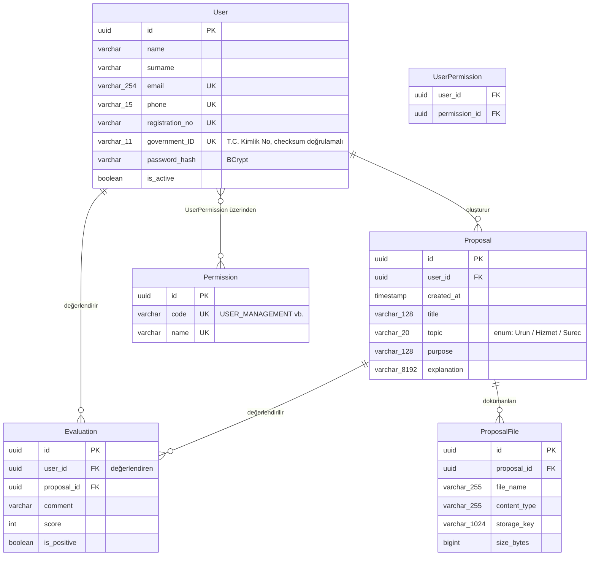

# Veritabanı Şeması

Bu diyagram `api/FikirHavuzuContext.cs` içindeki EF Core model yapılandırmasından türetilmiştir
ve o dosya ile senkron tutulmalıdır (bir migration eklediğinizde burayı da güncelleyin).
GitHub bu bloğu otomatik olarak görsel bir diyagram şeklinde render eder.

## Notlar

- Tüm birincil anahtarlar `uuid` (istemci tarafında, DB'ye ilk `Add` anında üretilir).
- `User.email`, `User.phone`, `User.registration_no`, `User.government_ID` ve
  `Permission.code`/`Permission.name` alanlarında benzersizlik (unique) kısıtı vardır.
- `User` ↔ `Permission` ilişkisi `UserPermission` ara tablosu üzerinden çoktan-çoğa (many-to-many);
  ara tablonun birincil anahtarı `(user_id, permission_id)` bileşik anahtarıdır.
- `Proposal.topic`, C# tarafında `ProposalTopic` enum'udur; veritabanında string olarak saklanır
  (`Urun` / `Hizmet` / `Surec`).
- `ProposalFile.storage_key`, dokümanın Cloudflare R2'deki nesne anahtarını tutar; ham baytlar
  veritabanında değil R2'de saklanır (bkz. `api/Services/Storage/`).
- Tablo ve kısıt adları kasıtlı olarak Türkçe bırakılmıştır (bkz. `FikirHavuzuContext.cs`).
